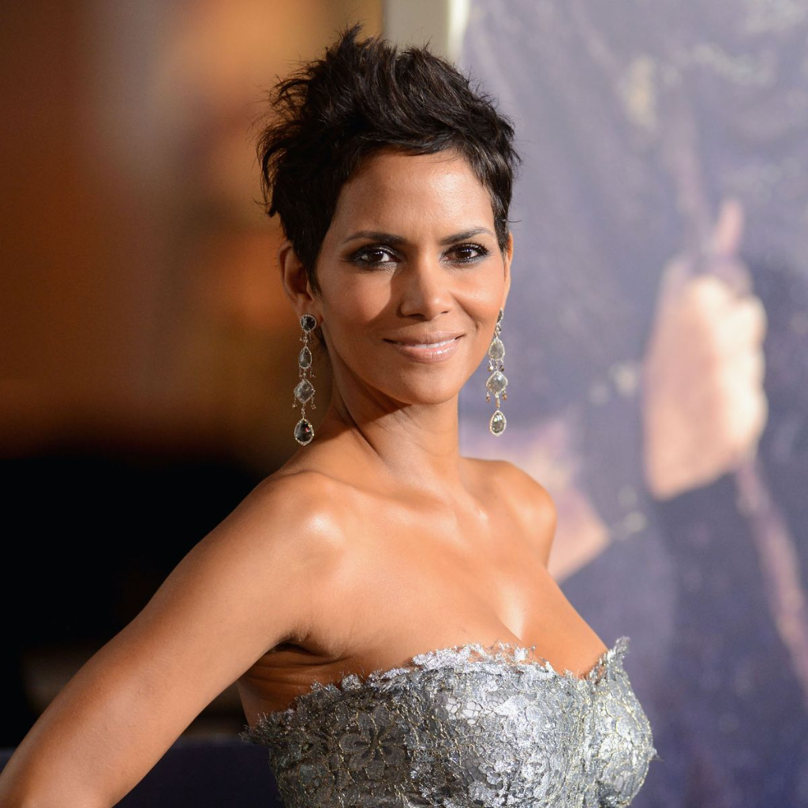

# InstantID Cog Model

## Overview
This repository contains the implementation of [InstantID](https://github.com/InstantID/InstantID) as a [Cog](https://github.com/replicate/cog) model. 

Using [Cog](https://github.com/replicate/cog) allows any users with a GPU to run the model locally easily, without the hassle of downloading weights, installing libraries, or managing CUDA versions. Everything just works.

## Development
To push your own fork of InstantID to [Replicate](https://replicate.com), follow the [Model Pushing Guide](https://replicate.com/docs/guides/push-a-model).

## Basic Usage
To make predictions using the model, execute the following command from the root of this project:
> **Note:**  
> default SDXL model: AlbedoBase XL V2  
> default scheduler: 4-step sdxl-lighting for fast inference

```bash
cog predict \
-i face_image_path=@examples/halle-berry.jpeg \
-i prompt="woman as elven princess, with blue sheen dress" \
-i negative_prompt="nsfw" \
-i adapter_strength_ratio=0.8 \
-i identitynet_strength_ratio=0.8 \
-i safety_checker=True
```

<table>
  <tr>
    <td>
      <p align="center">Input</p>
      
    </td>
    <td>
      <p align="center">Output</p>
      
    </td>
  </tr>
</table>

To change the denoising steps, use argument: 
```bash
-i lightning_steps="2step" (or "8step")
``` 
To use a custom scheduler, pose controlnet and a different base SDXL model:  


```bash
Example:
cog predict \
-i face_image_path=@examples/halle-berry.jpeg \
-i pose_image_path=@examples/poses/ballet-pose.jpg \
-i prompt="photo of a ballerina on stage" \
-i model="Juggernaut XL V8" \
-i adapter_strength_ratio=0.8 \
-i identitynet_strength_ratio=0.8 \
-i pose=True \
-i pose_strength=0.4 \
-i enable_fast_mode=False \
-i scheduler="DPMSolverMultistepScheduler-Karras" \
-i num_steps=30 \
-i guidance_scale=4 \
-i safety_checker=True
```

## Input Parameters

The following table provides details about each input parameter for the `predict` function:  

| Parameter                    | Description                             | Default Value                                     | Range       |
| ---------------------------- | --------------------------------------- | --------------------------------------------------| ----------- |
| `face_image_path`            | Input image                             | A path to the input image file                    | Path string |
| `pose_image_path`            | Input image                             | A path to the reference pose image file           | Path string |
| `prompt`                     | Input prompt                            | "a person"                                        | String      |
| `negative_prompt`            | Input Negative Prompt                   | "ugly, low quality, deformed face"                | String      |
| `model`                      | SDXL image model choices                | "AlbedoBase XL V2"                                | String      |
| `enable_fast_mode`           | enable SDXL-Lightning LoRA              | True                                              | Boolean     |
| `lightning_steps`            | select SDXL-Lightning denoising steps   | "4step"                                           | String      |
| `scheduler`                  | scheduler algorithm choices             | "DPMSolverMultistepScheduler"                     | String      |
| `adapter_strength_ratio`     | Scale for IP adapter                    | 0.8                                               | 0.0 - 1.0   |
| `identitynet_strength_ratio` | Scale for ControlNet conditioning       | 0.8                                               | 0.0 - 1.0   |
| `pose`                       | select ControlNet pose model            | False                                             | Boolean     |
| `pose_strength`              | Scale for pose conditioning             | 0.5                                               | 0.0 - 1.5   |
| `canny`                      | select ControlNet canny edge model      | False                                             | Boolean     |
| `canny_strength`             | Scale for canny edge conditioning       | 0.5                                               | 0.0 - 1.5   |
| `depth_map`                  | select ControlNet depth model           | False                                             | Boolean     |
| `depth_strength`             | Scale for depth map conditioning        | 0.5                                               | 0.0 - 1.5   |
| `num_steps`                  | Number of denoising steps               | 25                                                | 1 - 50      |
| `guidance_scale`             | Scale for classifier-free guidance      | 7                                                 | 1 - 10      |
| `seed`                       | RNG seed number                         | 0 (= random seed)                                 | 0 - int MAX |
| `safety_checker`             | Enable or disable NSFW filter           | True                                              | Boolean     |
